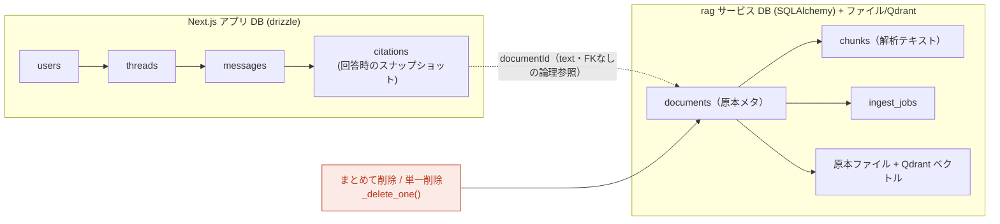
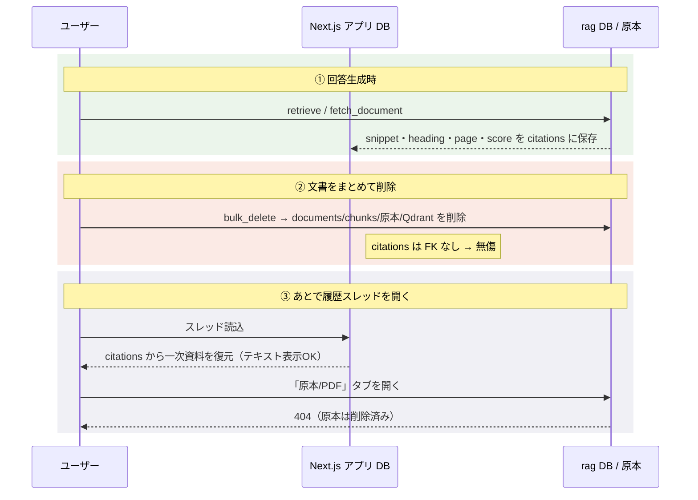

# 引用（一次参照）と文書削除のデータフロー

文書を削除したとき、対話履歴の「一次参照」がどうなるか。要点は **引用データと文書本体が別DB・FKなしで保存されている** こと。

## 2つのデータストア

ARag のデータは物理的に分かれている。

- **実線** = 同一DB内のカスケード（親が消えれば子も消える）。
- **点線** = DBをまたぐ論理参照。FKがないので削除は伝播しない。
- 削除が消すのは右側（rag）だけ。左側の `citations` は無傷。

- `citations.documentId` は **ただの `text` 列**。外部キーではない（`src/lib/db/schema.ts:42`）。
- `citations` のカスケードは `messageId → messages → threads → users` のみ（`schema.ts:40`）。
- つまり **rag 側の文書を削除しても `citations` 行は消えない**。

## 引用はスナップショット

回答生成時に、引用は `citations` 行へ次を保存する（live 文書を後から引かない）。

| 列 | 内容 |
|----|------|
| `documentId` / `documentTitle` | 文書ID（text参照）/ タイトル |
| `headingPath` | 見出しパス |
| `snippet` | **引用本文テキスト** |
| `blockType` / `page` | ブロック種別 / ページ番号 |
| `ordinal` / `score` | 引用番号 [1][2]… / 再ランクスコア |

履歴スレッドを開くと `sourcesFromCitations()` がこの行から `Source` を復元する（`src/lib/threads.ts:134-155`、本文は `body: c.snippet`）。**ライブの文書取得は行わない。**

## 時系列フロー（回答 → 削除 → 履歴閲覧）

## 文書削除後、履歴で「残るもの / 壊れるもの」

| 要素 | 削除後 | 理由 |
|------|--------|------|
| 引用番号 [1][2]… とハイライト対応 | ✅ 残る | `citationMap` も保存済み |
| 一次資料パネルの「HTML整形」表示（既定ビュー） | ✅ 残る | 保存済み `snippet` を描画 |
| 見出し・ページ番号・関連度スコア | ✅ 残る | スナップショット |
| 「原本 / PDF」タブ・「ソースを新しいタブで開く」 | ❌ 404 | `/api/documents/{id}/raw` をライブ取得（`src/components/sources/right-panel.tsx:65,114`）。rag 側の文書が消えると読めない |

→ **引用された証跡テキストは履歴に残り、壊れるのは「原本ファイルを開く」導線だけ。** これは単一削除でも一括削除でも同じ（削除処理は共通の `_delete_one`、`rag/app/routers/documents.py`）。

## 関連コード

- 引用スキーマ: `src/lib/db/schema.ts`（`citations`）
- 履歴復元: `src/lib/threads.ts`（`sourcesFromCitations`）
- 一次資料パネル: `src/components/sources/right-panel.tsx`
- 文書削除（単一/一括 共通）: `rag/app/routers/documents.py`（`_delete_one` / `delete_document` / `bulk_delete_documents`）

## 改善余地（任意）

原本タブを開くと無言で 404 になる。right-panel で raw 取得失敗時に「この文書は削除済みです（引用テキストのみ表示）」とフォールバック表示すると親切。必須ではない。
