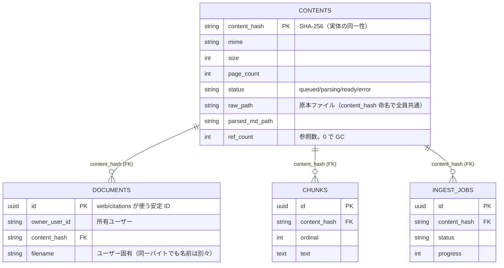
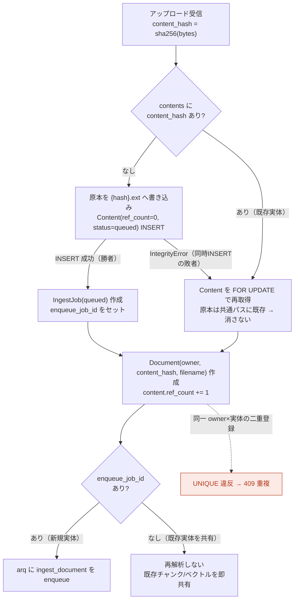
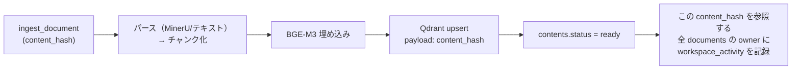
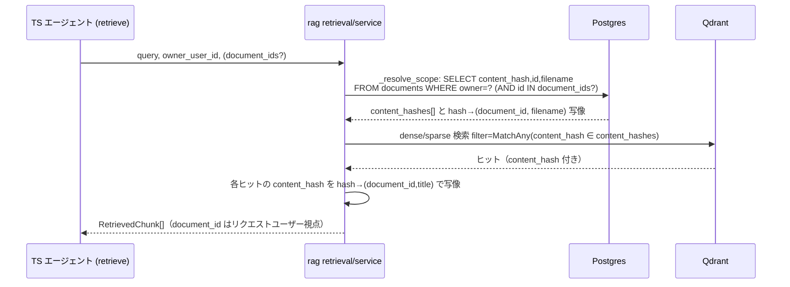
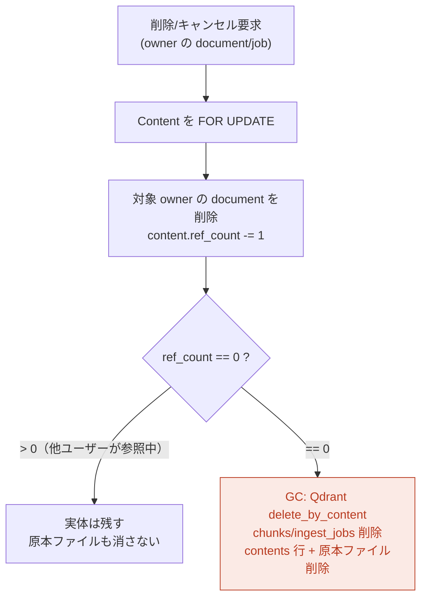
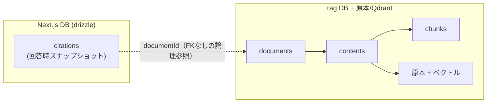

# 横断共有（コンテンツアドレス方式）のデータフロー

複数ユーザーが**同一バイトのファイル**をアップロードしても、解析・チャンク・ベクトルを
**1 部だけ**持ち、各ユーザーには自分用の「参照」を見せる仕組み。鍵は
`content_hash`（ファイルの SHA-256）で**実体（contents）**と**ユーザー参照（documents）**を
分離し、`ref_count` で実体を GC すること。

> 旧ノート `citation-document-data-flow.md` を本ノートへ統合した（rag 側モデルが
> content-address 化で変わったため）。citations の耐久性は末尾「引用の耐久性」に再掲。

## 1. データモデル

要点（`rag/app/models.py`）:

- **contents** = 同一バイトの実体。`content_hash` 単位で 1 個だけ。原本・解析 MD・チャンク・
  Qdrant ベクトル・ジョブを所有する。`ref_count` が 0 になったら丸ごと GC。
- **documents** = ユーザーごとの参照（library entry）。`id` は据え置きの安定識別子で、
  web 側 `citations.documentId` が指す先。`UNIQUE(owner_user_id, content_hash)` で
  **同一ユーザー × 同一実体は 1 行**に制約。
- **chunks / ingest_jobs** は `document_id` ではなく **`content_hash` に紐づく**（実体が所有）。
- 原本ファイルは `raw_path = {content_hash}{ext}` という**全員共通パス**に保存される
  （→ 同時アップロードの競合に強い。後述）。

## 2. アップロード（dedup ＋ refcount）

`rag/app/routers/documents.py::create_document`。`content_hash` の Content 行を
`SELECT ... FOR UPDATE` で直列化し、新規実体のときだけ解析ジョブを enqueue する。

- **別ユーザーが同じ実体を上げる** → `documents` を 1 行追加して `ref_count++` するだけ。
  **再解析・再埋め込みは走らない**（既存チャンク/ベクトルを即共有）。
- **同じユーザーが同じ実体を再アップロード** → `UNIQUE(owner, content_hash)` 違反で **409**。
- **同時アップロード競合（同一バイト）**: 勝者だけが Content を INSERT して enqueue、
  敗者は `IntegrityError` を捕捉して FOR UPDATE で再取得。原本は `content_hash` 命名の
  **共通パス**なので敗者がファイルを消しても勝者を壊さない（孤児ファイルも残らない）。

## 3. ワーカー（content_hash 単位で解析）

`rag/app/worker.py::ingest_document(content_hash, job_id)`。実体 1 個を解析し、
その実体を参照する**全ユーザーのワークスペース活動**を更新する。

- チャンク・ベクトルは `content_hash` を持つ（`document_id` は持たない）。
- `workspace_activity`（`owner_user_id` PK / `last_document_activity_at`）は
  **実体を共有する全 owner** 分を更新する。

## 4. 検索（content_hash で絞り、document_id へ写像）

`rag/app/retrieval/service.py`。Qdrant は実体共有なので全員のチャンクが同居する。
**owner のスコープに属する `content_hash` 集合だけ**に絞り、ヒットを
**そのユーザーの `document_id`** へ写像して返す。

- **スコープ制限**: 他人の実体ヒットは `content_hashes` に入らないので返らない。
- **写像の一意性**: `UNIQUE(owner, content_hash)` により owner 内で
  `content_hash → document_id` は 1:1。**同じ実体でも、見えるのは各自の document_id/filename**。
- `document_ids` 指定時はその範囲の `content_hash` だけにさらに絞り込む。

## 5. 配信・fetch/preview（content_hash で解決）

`/documents/{id}/raw`・chunks・preview は、まず `documents` で
**所有確認（owner_user_id）**してから `content_hash` 経由で実体（原本/MD/チャンク）を返す。
**非所有者には 404**（実体は共有でも、参照を持たないユーザーには見えない）。

## 6. 削除・キャンセル・再試行（ref_count GC）

`_delete_one` / `cancel_job` / `retry_job`。参照を 1 つ減らし、**`ref_count` が 0 に
なった実体だけ**を物理削除する。

- 他ユーザーが同じ実体を参照していれば、**自分が消しても実体は残る**（相手は無傷）。
- `ref_count` が 0 になって初めて Qdrant ベクトル・チャンク・ジョブ・原本ファイルを GC。
- `cleanup_document_files()` は `raw_path=None`（＝実体が残る）で呼ばれた時は何もしない。

## 7. 引用（citations）の耐久性 ＝ web 側スナップショット

web 所有の `citations` は **FK なしの論理参照 `documentId`（text）**で rag を指す。
回答生成時に `snippet`・`headingPath`・`page`・`score` 等を**スナップショット保存**するため、
**rag 側の実体や document を削除しても citations 行は無傷**（履歴のテキスト表示は維持）。

| 履歴で | 削除後 | 理由 |
|--------|--------|------|
| 引用番号 [1][2]・ハイライト | ✅ 残る | `citationMap` 保存済み |
| 一次資料テキスト（既定ビュー） | ✅ 残る | `snippet` を描画 |
| 見出し・ページ・スコア | ✅ 残る | スナップショット |
| 「原本 / PDF」タブ | ⚠️ フォールバック | `right-panel.tsx` が HEAD で原本存在確認、無ければ「削除済み」表示 |
| 「ソースを新しいタブで開く」 | ❌ 404 | `/api/documents/{id}/raw` をライブ取得（実体 GC 済みなら読めない） |

> ⚠️ 既知の落とし穴（修正済み）: rag の raw ルートが GET のみだと FastAPI が HEAD を
> 自動付与せず 405 → プロキシが 404 に変換し**実在文書でも常に「削除済み」**になる。
> `@router.api_route(..., methods=["GET","HEAD"])` で解消。

## 関連コード

- データモデル: `rag/app/models.py`（`Content`/`Document`/`Chunk`/`IngestJob`/`WorkspaceActivity`）
- アップロード dedup/refcount: `rag/app/routers/documents.py::create_document`
- 削除/キャンセル/再試行 GC: `rag/app/routers/documents.py`（`_delete_one`/`cancel_job`/`retry_job`）
- 一覧・統計: `rag/app/documents_service.py`（`list_documents`/`workspace_stats`）
- ワーカー: `rag/app/worker.py::ingest_document`
- 検索スコープ・写像: `rag/app/retrieval/service.py`（`_resolve_scope`/`_hit_rows`）
- ベクトル: `rag/app/vectorstore/qdrant.py`（payload `content_hash`、`delete_by_content`）
- マイグレーション: `rag/alembic/versions/c1d2e3f4a5b6_content_addressed_store.py`
- 引用スキーマ/復元: `src/lib/db/schema.ts`（`citations`）/ `src/lib/threads.ts`（`sourcesFromCitations`）
