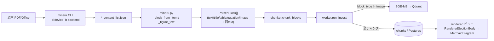

# パース（MinerU）と図表テキストの索引化・表示

PDF/Office をどう解析し、**図表の中のテキスト**を検索（索引）と表示にどう載せるかをまとめる。
データモデル（contents/documents/chunks）は [`cross-user-content-dedup.md`](./cross-user-content-dedup.md)、
検索品質評価は [`rag-eval-harness.md`](./rag-eval-harness.md) を参照。

## 0. 要点

- 解析方式は `MINERU_BACKEND` で切替（`rag/app/config.py`）。**dev=CPU/`pipeline`**、**prod=CUDA/`hybrid-auto-engine`**。
- hybrid(VLM) は図を解釈し、図中テキストを `content_list.json` の **`image` ブロックの `image_caption` と新規 `content`**（例: mermaid フローチャート）に出す。
- 画像チャンクは**表示専用で Qdrant 索引から除外**されるため、図表テキストを検索に載せるには
  正規化層（`mineru.py`）で**独立した `text` ブロックに展開**する。
- 表示側は rendered ビューでチャンクを segment 分割し、**mermaid は図として描画**（`MermaidDiagram`）。

## 1. 全体フロー



## 2. バックエンド切替（`config.py`）

| | dev（Mac/Docker・CPU） | prod（CUDA/GPU） |
|---|---|---|
| `DEVICE` | `cpu` | `cuda` |
| `MINERU_BACKEND` | `pipeline`（既定） | `hybrid-auto-engine` |
| 図中テキスト | 取り込まない（図は画像のまま） | VLM が `--image-analysis` で解釈 |
| VLM 推論 | しない（vllm 不要） | vllm + `opendatalab/MinerU2.5-Pro-2604-1.2B` |

許容値は `pipeline` / `hybrid-auto-engine` / `vlm-auto-engine`（`vlm-auto-engine` は純 VLM・現状未使用）。
`mineru -b` の実在値と一致（`vlm-http-client` / `hybrid-http-client` は別ホスト推論で未採用）。
VLM 系バックエンド時のみ起動時に MinerU2.5 を事前取得（`main.py` の `_maybe_preload_vlm`）。

## 3. content_list の正規化（`rag/app/parsing/mineru.py`）

`parse()` が `mineru -p <raw> -o <out> -d <device> -b <backend>` を実行し、
`*_content_list.json` を `ParsedBlock` 列へ正規化する。`type` → ブロック種別は `_TYPE_MAP`
（`text`/`title`/`table`/`equation`/`image`、`list`/`index` は text 扱い）。

### 図表テキストの格納先（MinerU 3.1.15・hybrid 実測）

`image` ブロックは次のキーを持つ（pipeline では caption/content は空）。

- `image_caption`: VLM の自然言語解釈（例「赤枠はV-12バイパス弁を示す。…V-12固着を第一候補として点検する。」）
- `content`（`sub_type=flowchart` 等）: 図構造の構造化転写。例:
  ```mermaid
  graph LR
    A["P-04"] --> B["HX-7 熱交換器"]
    B --> C["V-12"]
  ```
- 注意: caption の実キーは **`image_caption`**（旧 `img_caption` ではない）。`_block_from_item` は
  `image_caption`（fallback `img_caption`）から取り込む。

### 図表テキストを索引へ載せる仕組み

`worker.py` は `block_type=="image"` を**埋め込み・Qdrant 登録から除外**する（画像は表示専用）。
そのため figure caption/content を image ブロックに入れても**検索には乗らない**。
`mineru.py` は画像に対し、`image_caption` + `content` を連結した **独立の `text` ブロック**
（`_figure_text`）を画像直後に追加して索引対象にする。図テキストの無い装飾画像は追加しない
（ノイズ回避）。

```
[image]              ← 表示専用（索引除外）
[text]   caption + content(mermaid…)      ← BGE-M3 で埋め込み・Qdrant 索引
```

## 4. チャンク化と索引（`chunker.py` / `worker.py`）

- `chunk_blocks`: text は見出しスタックに沿って結合、table/equation/image は atomic。
  image チャンク本文は `` の markdown。
- `run_ingest`: 再実行時は旧チャンク(PG)・旧ベクトル(Qdrant)を掃除 → parse → chunk →
  **image 以外**を埋め込み → Qdrant upsert。コレクションは `arag_chunks__<embedder>`。

## 5. 表示（web）

rendered（チャンク）ビューは `documents-modal` の `RenderedChunk` → `RenderedSectionBody`。
`parseSectionBody`（`src/components/sources/parse-section-body.ts`）が本文を順序付き segment へ分割する。

| segment | 検出 | 描画 |
|---|---|---|
| `table` | `<table>…</table>` | `HtmlTable` |
| `image` | `` | `SectionImage` |
| `mermaid` | ` ```mermaid …``` `（閉じフェンスが後続文に密着しても分割） | `MermaidDiagram` |
| `text` | 上記以外 | `TeXText`（$…$/$$…$$ を KaTeX） |

`MermaidDiagram`（`src/components/sources/mermaid-diagram.tsx`）の要点:

- `mermaid`(v11) を**動的 import** で遅延読込。描画前/失敗時は元コードへフォールバック。
- `securityLevel: "antiscript"` … DOMPurify でスクリプト/イベントハンドラを除去しつつ
  **HTML ラベル(foreignObject)** を許可（`strict` は SVG テキスト描画になり CJK 幅を過小評価して文字切れ）。
- `flowchart.htmlLabels: true` + `wrappingWidth: 500` … 既定 200px だと CJK ラベルが超過し
  nowrap でクリップされるため、1 行で収まる幅を確保（横長は rendered コンテナの `overflow-x` で吸収）。
- 検索用 index のチャンク本文は mermaid を**含んだまま**保持する（表示の変更のみ）。

> 「markdown」タブ（MinerU の元 `.md` を `MarkdownView` で描画）の mermaid は未対応。
> 必要なら `MarkdownView` の code コンポーネントでも `MermaidDiagram` に委譲する。

## 6. GPU 運用メモ

- 起動は CLAUDE.md「GPU 起動」を参照。`-f` 明示時は `docker-compose.override.yml` も含める
  （含めないと Postgres が 5433→5432 に戻り web login が失敗）。
- GPU 割当は `deploy.resources.reservations.devices`（`gpus: all` は Compose v2.30+ 必須）。
- モデル供給は `MINERU_MODEL_SOURCE`（既定 huggingface）。HF の LFS 配信が不安定な環境では
  `MINERU_MODEL_SOURCE=modelscope` を付与。初回取得後は `HF_HUB_OFFLINE=1` でキャッシュ運用。

## 7. 既存ドキュメントの再索引（図中画像の再解析）

`POST /jobs/{job_id}/retry`（web: アップロード一覧の再試行）でジョブを再キューすると、
worker が `run_ingest` を最初からやり直す。再パースは**その時 worker が動かしている backend**
（`MINERU_BACKEND`/`DEVICE`）を使うため、hybrid/GPU の worker なら図中テキストが抽出・索引化される。

注意点:

- 再アップロードは content-hash dedup でスキップされ再パースされない。必ず retry を使う。
- arq は `enqueue_job(..., _job_id=job.id)` で **同一 job_id を重複実行しない**。直近に完了した
  ジョブ（既定 `keep_result` ≈1時間）を再 retry すると no-op になる。
- 多数を確実にやり直すなら、CLAUDE.md「索引の全リセット」後に再 ingest する方が確実
  （既存データは破棄）。
