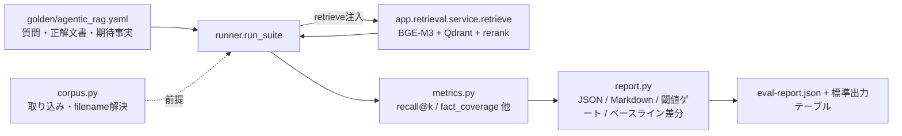

# RAG 検索品質 評価ハーネス（rag/eval/）

検索・回答品質を**定量的かつ回帰的**に測る仕組み（issue #13）。
ゴールデンセットに対して検索を回し、**文書レベル recall@k** と **事実グラウンディング (fact_coverage)**
を算出する。LLM を使わず決定的に測れるのが要点。回答生成（faithfulness）は TS 側にあるため
本フェーズは方針のみ（末尾参照）。

- 設計スペック: `docs/superpowers/specs/2026-06-05-arag-rag-eval-harness-design.md`
- 実装計画: `docs/superpowers/plans/2026-06-05-arag-rag-eval-harness.md`

## 1. 全体像



**設計の肝**: `runner.run_suite(suite, retrieve_fn)` は `retrieve_fn` を**注入**で受ける。

- 本番: `retrieve_fn` が `app.retrieval.service.retrieve(...)` を呼ぶ（実 BGE-M3 + Qdrant）。
- スモーク: fake な関数を渡し、DB/Qdrant/モデル**非依存**で純粋にハーネス論理を検証。

## 2. ファイル構成と責務

| ファイル | 責務 | 依存 |
| --- | --- | --- |
| `eval/dataset.py` | ゴールデンの pydantic モデル + YAML ローダ + 検証 | pyyaml, pydantic |
| `eval/metrics.py` | 純関数: `normalize_text` / `recall_at_k` / `precision_at_k` / `mrr` / `ndcg_at_k` / `fact_coverage` | なし（I/O なし） |
| `eval/runner.py` | `retrieve` 注入式ランナー。ケース毎実行→集計 | dataset, metrics |
| `eval/report.py` | JSON/Markdown 生成 / 閾値ゲート / ベースライン差分 | dataset |
| `eval/corpus.py` | filename→document 解決 + 同期取り込み（**DB/Qdrant に触る唯一の層**） | app.worker, app.models 等 |
| `eval/__main__.py` | CLI: `ingest` / `run` サブコマンド | 上記全部 + app.* |
| `eval/golden/agentic_rag.yaml` | ゴールデンセット（デモ8ケース母体、現状6ケース） | — |
| `eval/baselines/agentic_rag.json` | メトリクス基準値（回帰検出）。**2026-06-05 実測**（recall@5=1.0, fact_coverage=0.833） | — |

テスト: `tests/test_eval_{metrics,dataset,runner,report,corpus}.py`, `tests/test_qdrant_collection_name.py`

## 3. ゴールデンセットのスキーマ

ラベルは**ファイル名 + 事実文字列**（チャンクID非依存 ＝ 再インデックスに強い）。

```yaml
suite: agentic_rag_demo
owner_user_id: __eval__          # 評価専用オーナー（共有DBを汚さない隔離キー）
documents: [06-multi-file-requirement-request.pdf, ...]
thresholds:                       # --gate で使う集計平均の下限
  recall_at_5: 0.80
  fact_coverage: 0.70
cases:
  - id: case3-edge-gateway-select
    query: "エッジAIゲートウェイを1つ選ぶなら…"
    rewritten: null               # 任意。書き換えを固定したいときのみ
    top_k: 6
    relevant_documents:           # 文書レベル正解（ファイル名）
      - 06-multi-file-requirement-request.pdf
      - 07-multi-file-security-policy.pdf
    key_facts:                    # 事実グラウンディング（any のいずれかが top-k 本文に出現で充足）
      - any: ["AlphaGate X2", "AlphaGate"]   # 表記ゆれを alias で吸収
      - any: ["2026-06-05"]
```

検証ルール: `relevant_documents ⊆ documents`。違反すると `load_suite` が ValueError。

## 4. メトリクス定義

文書集合 = retrieve 結果チャンクの所属 `document_title`（= filename）を順位順に重複排除した列 `D`、
正解集合 `R`（複数可）。

- **recall@k** = |unique(D[:k]) ∩ R| / |R|（`R` 空なら 1.0）
- **precision@k** = ヒット数 / k
- **MRR** = 1 / (R に属する最初の文書の順位)、当たらなければ 0
- **nDCG@k** = DCG/IDCG（gain は R 所属で 1）
- **fact_coverage** = 充足事実数 / 全事実数。各 `key_fact` は `any` の別名いずれかが
  top-k 本文（`expanded_text` 優先）の**正規化済み連結文字列**に部分一致すれば充足。
  正規化 `normalize_text` = NFKC（全角→半角）+ 空白圧縮 + 小文字化。**LLM 不要・決定的**。

集計はケース平均。`run_suite` の戻り値は `{"suite", "cases":[...], "aggregate":{metric:mean}}`。

## 5. 実行方法

### 5.1 スモーク（モデル/サービス不要・高速）

PR CI と同じ。`--noconftest` で autouse fixture 経由の `app`/DB import を避ける。

```bash
cd rag
uv run pytest --noconftest \
  tests/test_eval_metrics.py tests/test_eval_dataset.py \
  tests/test_eval_runner.py tests/test_eval_report.py -v
```

`corpus.resolve` の DB テストと命名テストは Postgres(5433)/Qdrant 稼働が前提:

```bash
cd rag
uv run pytest tests/test_eval_corpus.py tests/test_qdrant_collection_name.py -v
```

### 5.2 本番実評価（フルスタック必須）

> **重要**: rag はベイク済み Docker イメージ。eval コードは Dockerfile の `COPY eval ./eval`
> で同梱されるため、**eval を変更したら必ず `--build` で再ビルド**する。
> デモPDFは compose の read-only マウント（`./docs/demo-files:/data/demo-files:ro`）から読む。

```bash
# 1) フルスタック起動（rag を再ビルドして eval/ を焼き込む）
docker compose --profile worker up -d --build rag

# 2) ゴールデン文書を owner=__eval__ で同期取り込み（parse→chunk→embed→Qdrant）
docker compose exec -T rag uv run python -m eval ingest

# 3) 評価実行（ゲート + ベースライン差分 + JSON 出力）
docker compose exec -T rag uv run python -m eval run \
  --gate --baseline eval/baselines/agentic_rag.json --out eval-report.json
```

CLI オプション:

| サブコマンド / フラグ | 意味 | 既定 |
| --- | --- | --- |
| `ingest --golden <yaml>` | ゴールデンの `documents` を取り込む | `eval/golden/agentic_rag.yaml` |
| `ingest --files-dir <dir>` | 原本PDFの所在 | `/data/demo-files`（compose マウント先） |
| `run --golden <yaml>` | 評価対象スイート | 同上 |
| `run --out <path>` | レポート JSON 出力先 | なし（標準出力のみ） |
| `run --baseline <path>` | ベースライン JSON（差分表示） | なし |
| `run --gate` | 閾値未達で**非ゼロ終了**（CI ゲート） | off |

`run` は実行前に `corpus.resolve` で全 `documents` が取り込み済みか検証し、
未取り込みなら欠落ファイル名を挙げて `ingest` を促す。

### 5.3 ローカル直実行（コンテナ外）

ホストで直接動かす場合は `--files-dir` で原本ディレクトリを上書きする
（既定 `/data/demo-files` はコンテナ内パスのため）:

```bash
cd rag
uv run python -m eval ingest --files-dir ../docs/demo-files
uv run python -m eval run --out eval-report.json
```

## 6. ベースラインの更新

`baselines/agentic_rag.json` は **2026-06-05 の初回フルスタック実評価で実測値に更新済み**
（recall@5=1.0 / MRR=1.0 / nDCG=0.995 / precision@k=0.278 / fact_coverage=0.833）。
以後、意図的な品質変化のときだけ更新する:

```bash
# run --out で出した eval-report.json の aggregate を baseline へ反映してコミット
docker compose exec -T rag uv run python -m eval run --out eval-report.json
# 内容を確認のうえ baselines/agentic_rag.json を実測値に更新
git commit -m "feat: ベースラインを実測値で更新"
```

意図的な品質変化（モデル更新・チャンク戦略変更など）のときだけ更新する。
それ以外で差分が出たら**回帰**を疑う。

## 7. CI（2層）

- `.github/workflows/rag-eval-smoke.yml` — **毎PR**（`rag/eval/**`・`rag/app/vectorstore/**` 変更時）。
  GitHub-hosted で 5.1 のスモークを実行。モデル/サービス不要・高速。
- `.github/workflows/rag-eval-full.yml` — **手動 (`workflow_dispatch`) / 夜間 (cron 03:00 JST)**。
  `runs-on: [self-hosted, rag]` 前提（実 BGE-M3 + Qdrant + HF キャッシュが必要）。
  5.2 を実行し `eval-report.json` をアーティファクト化。HF オフライン制約のため
  GitHub-hosted では原則回さない。

## 8. 埋め込みモデル更新（バージョニング / ブルーグリーン）

Qdrant 既定コレクション名を `arag_chunks` 固定から
**`arag_chunks__{settings.embedder}`**（例 `arag_chunks__bge-m3`）に変更した
（`app/vectorstore/qdrant.py` の `default_collection_name()`、`settings.qdrant_collection`
が空なら導出）。これがモデル別バージョニングのフック。

手順:

1. 新モデルを設定 → コレクション名が自動で変わる（旧コレクションは温存）。
2. `chunks`（Postgres）から全チャンクを新モデルで再埋め込みし新コレクションへ upsert。
3. **同一ゴールデンで `eval run --gate` を新コレクションに対し実行**（＝品質ゲート）。
4. ゲート通過時のみサーブ切替、旧コレクション drop。未通過なら設定を戻すだけでロールバック。

> **注意（既存ローカル環境への影響）**: この命名変更で、旧 `arag_chunks` に入っていた
> 既存ベクトルは孤立する。ローカルで検索が空振りする場合は再インデックスが必要
> （CLAUDE.md「横断共有への移行リセット」で Qdrant を作り直す）。
> 明示固定したいときは `QdrantStore(collection=...)` か `settings.qdrant_collection` で上書き。

## 9. 現状の限界と今後

- **回答品質 (faithfulness) は未実装**。回答生成は TS 側（`src/lib/agent/run.ts`）にあるため、
  別ハーネス（`src/eval/`）として `runAgent` を golden cases で回し LLM-judge で
  faithfulness / answer-correctness / citation-precision を測る設計のみ提示済み。
  本フェーズの `fact_coverage` は「**生成なしで測れる回答可能性プロキシ**」。
- ゴールデンは現状6ケース（デモ母体）。`eval reindex` の完全実装は未了（方針 + フックのみ）。
- **実測で検出済みのギャップ**: `case2-image-grounding` は recall@5=1.0（正解PDFは取得）だが
  fact_coverage=0.0。図面由来の事実（`V-12`/`バイパス弁` 等）は**画像チャンクが索引外**のため
  テキスト検索で拾えない。画像グラウンディング/faithfulness 評価が次フェーズで要る定量的根拠。
- 同一ゴールデン YAML を TS 側評価でも共有の出所にする（`key_facts`=正確性、
  `relevant_documents`=引用妥当性）。
