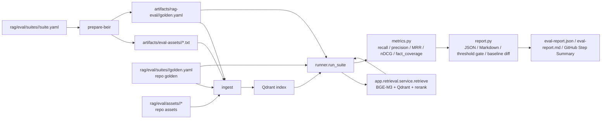

# RAG 検索品質 評価ハーネス

このハーネスは、RAG の検索部分を**定量的かつ回帰的**に測る仕組みです。
公開 retrieval benchmark の `corpus / queries / qrels` と、repo 管理の専用 golden set を
同じ評価 runner に通し、文書レベルの検索品質を決定的に評価します。

要点は次の 2 つです。

- LLM judge は使わない。検索結果に正解文書や期待事実が含まれるかを、固定ルールで測る。
- 公開データセットと独自 golden を併用する。外部に説明しやすい評価と、プロダクト固有の難所評価を分けて持つ。

回答生成の faithfulness / answer correctness / citation precision は、このハーネスの対象外です。
それらは `runAgent` など回答生成側を対象にした別ハーネスで、LLM judge または RAGAS / G-Eval 系の
評価を追加します。

## 1. 全体像



設計の肝は `runner.run_suite(suite, retrieve_fn)` が `retrieve_fn` を**注入**で受けることです。

- 本番評価では、`retrieve_fn` が `app.retrieval.service.retrieve(...)` を呼びます。
  つまり実際の BGE-M3、Qdrant、rerank を使います。
- スモークテストでは、fake な `retrieve_fn` を渡します。
  DB / Qdrant / モデルに依存せず、評価ハーネスのロジックだけを高速に検証できます。

## 2. 評価 suite の種類

現在は 2 層構成です。

| suite | 目的 | 資産の置き場所 |
| --- | --- | --- |
| `beir_scifact` | 公開データセットによる外部説明しやすい検索評価 | `rag/eval/suites/beir_scifact/suite.yaml` と `artifacts/` |
| `agentic_rag_demo` | 業務難所・エッジケース評価 | `rag/eval/suites/agentic_rag_demo/golden.yaml` と `rag/eval/assets/agentic_rag_demo/` |

`beir_scifact` は BEIR SciFact の公式 zip から生成します。生成物は `artifacts/` 配下に置き、
repo にはコミットしません。

`agentic_rag_demo` は自前で用意したものです。専用 golden と baseline は repo 管理します。

## 3. ファイル構成と責務

| ファイル | 責務 | 依存 |
| --- | --- | --- |
| `rag/eval/beir.py` | BEIR 形式の zip から text assets と generated golden を作る | urllib, zipfile, yaml |
| `rag/eval/dataset.py` | golden の pydantic model、YAML loader、検証 | pyyaml, pydantic |
| `rag/eval/metrics.py` | `normalize_text` / `recall_at_k` / `precision_at_k` / `mrr` / `ndcg_at_k` / `fact_coverage` | I/O なし |
| `rag/eval/runner.py` | `retrieve` 注入式 runner。ケースごとに検索を実行して集計 | dataset, metrics |
| `rag/eval/report.py` | JSON / Markdown report、閾値 gate、baseline diff | dataset |
| `rag/eval/corpus.py` | filename から原本を解決し、通常の ingest 経路へ流す | app.worker, app.models など |
| `rag/eval/__main__.py` | CLI: `prepare-beir` / `ingest` / `run` | 上記全部 + app.* |
| `rag/eval/suites/beir_scifact/suite.yaml` | BEIR SciFact の取得元、split、閾値、実行規模 | - |
| `rag/eval/suites/agentic_rag_demo/golden.yaml` | 専用 golden set | - |
| `rag/eval/suites/<suite>/baselines/<embedder>__<reranker>.json` | baseline。意図しない品質低下の検出に使う | - |

テストは主に次のファイルです。

```text
rag/tests/test_eval_beir.py
rag/tests/test_eval_dataset.py
rag/tests/test_eval_metrics.py
rag/tests/test_eval_runner.py
rag/tests/test_eval_report.py
rag/tests/test_eval_corpus.py
rag/tests/test_qdrant_collection_name.py
```

## 4. 標準ディレクトリ

```text
rag/eval/suites/<suite>/suite.yaml
rag/eval/suites/<suite>/golden.yaml
rag/eval/suites/<suite>/baselines/<embedder>__<reranker>.json
rag/eval/assets/<suite>/
artifacts/eval-assets/<suite>/
artifacts/eval-cache/
artifacts/rag-eval/<suite>/
```

使い分けは次のとおりです。

- `rag/eval/suites/<suite>/`: 評価定義、golden、baseline。repo 管理する。
- `rag/eval/assets/<suite>/`: 専用 golden の小さな評価資産。必要なものだけ repo 管理する。
- `artifacts/eval-assets/<suite>/`: 公開データセットから生成した評価資産。repo には入れない。
- `artifacts/eval-cache/`: 公開データセット zip などの cache。repo には入れない。
- `artifacts/rag-eval/<suite>/`: report と generated golden。repo には入れない。

レポートをコンテナ内に閉じ込めないため、Docker Compose では `artifacts/rag-eval` を
コンテナの `/data/eval-reports` に volume mount しています。つまり report はホスト側に残り、
GitHub Actions では artifact と Step Summary にも出します。

## 5. Golden set のスキーマ

ラベルは**ファイル名 + 事実文字列**です。チャンク ID には依存しません。
そのため、再インデックスやチャンク分割の微調整に比較的強いです。

```yaml
suite: agentic_rag_demo
owner_user_id: __eval_agentic_rag_demo__
files_dir: /data/repo-eval-assets/agentic_rag_demo
documents:
  - 06-multi-file-requirement-request.pdf
  - 07-multi-file-security-policy.pdf
thresholds:
  recall_at_5: 0.80
  fact_coverage: 0.70
cases:
  - id: case3-edge-gateway-select
    query: "エッジAIゲートウェイを1つ選ぶなら、どの候補が要件に合うか"
    rewritten: null
    top_k: 6
    relevant_documents:
      - 06-multi-file-requirement-request.pdf
      - 07-multi-file-security-policy.pdf
    key_facts:
      - any: ["AlphaGate X2", "AlphaGate"]
      - any: ["2026-06-05"]
    tags: ["multi-file", "requirements"]
```

主な項目は次のとおりです。

| 項目 | 意味 |
| --- | --- |
| `suite` | suite 名。CI の入力値にも使う |
| `owner_user_id` | 評価専用 owner。通常データと混ざらないようにする |
| `files_dir` | suite の原本ファイル置き場。CLI 引数で上書き可能 |
| `documents` | 評価対象文書 |
| `thresholds` | `--gate` で使う集計平均の下限 |
| `cases[].query` | 実際に検索する質問 |
| `cases[].rewritten` | 書き換え query を固定したい場合だけ使う |
| `cases[].top_k` | その case の検索件数 |
| `cases[].relevant_documents` | 正解文書の filename |
| `cases[].key_facts` | top-k 本文に含まれてほしい事実。`any` で表記ゆれを吸収する |
| `cases[].tags` | 分析用 tag |

検証ルールとして、`relevant_documents` は `documents` に含まれている必要があります。
違反すると `load_suite` がエラーにします。

## 6. メトリクス定義

検索結果チャンクの所属文書 `document_title` を順位順に重複排除した列を `D`、
正解文書集合を `R` とします。

- **recall@k** = `|unique(D[:k]) ∩ R| / |R|`
- **precision@k** = `hit count / k`
- **MRR** = 正解文書が初めて出た順位の逆数。当たらなければ `0`
- **nDCG@k** = `DCG / IDCG`。正解文書なら gain `1`
- **fact_coverage** = 充足した `key_facts` 数 / 全 `key_facts` 数

`fact_coverage` は top-k 本文を連結し、`key_facts[].any` のどれかが含まれていれば充足とします。
本文は `expanded_text` を優先し、なければ通常 text を使います。

正規化は `normalize_text` で行います。

- NFKC 正規化
- 空白圧縮
- 小文字化

このため `fact_coverage` も LLM 不要で決定的です。ただし、意味的に同じでも文字列が出ていない場合は
拾えません。これは「回答品質」ではなく「検索結果に回答材料が含まれているか」の proxy です。

## 7. CLI 実行方法

### 7.1 スモークテスト

モデル、DB、Qdrant を使わない高速テストです。PR CI と同じ考え方です。

```bash
cd rag
uv run pytest --noconftest \
  tests/test_eval_beir.py \
  tests/test_eval_metrics.py \
  tests/test_eval_dataset.py \
  tests/test_eval_runner.py \
  tests/test_eval_report.py -v
```

`corpus.resolve` の DB テストと Qdrant collection 名のテストは、Postgres / Qdrant の稼働が前提です。

```bash
cd rag
uv run pytest tests/test_eval_corpus.py tests/test_qdrant_collection_name.py -v
```

### 7.2 公開データセット評価: `beir_scifact`

ホスト直実行で小さく試す例です。

```bash
cd rag
uv run python -m eval prepare-beir \
  --suite beir_scifact \
  --assets-dir ../artifacts/eval-assets/beir_scifact \
  --golden-out ../artifacts/rag-eval/beir_scifact/golden.yaml \
  --cache-dir ../artifacts/eval-cache \
  --query-limit 100 \
  --corpus-limit 0
```

Docker Compose 上で実スタック評価する例です。

```bash
docker compose --profile worker up -d --build rag

docker compose exec -T rag uv run python -m eval prepare-beir \
  --suite beir_scifact \
  --assets-dir /data/eval-assets/beir_scifact \
  --golden-out /data/eval-reports/beir_scifact/golden.yaml \
  --cache-dir /data/eval-cache \
  --query-limit 100 \
  --corpus-limit 0

docker compose exec -T rag uv run python -m eval ingest \
  --suite beir_scifact \
  --golden /data/eval-reports/beir_scifact/golden.yaml \
  --files-dir /data/eval-assets/beir_scifact

docker compose exec -T rag uv run python -m eval run \
  --suite beir_scifact \
  --golden /data/eval-reports/beir_scifact/golden.yaml \
  --gate \
  --out /data/eval-reports/beir_scifact/eval-report.json
```

`corpus-limit 0` は full corpus を意味します。Windows の self-hosted runner では時間がかかるため、
日常確認では `corpus-limit 1000` などで縮小し、正式評価や夜間評価で full を回す運用が現実的です。

### 7.3 専用 golden 評価: `agentic_rag_demo`

以前の独自テストを残した suite です。

```bash
docker compose --profile worker up -d --build rag

docker compose exec -T rag uv run python -m eval ingest \
  --suite agentic_rag_demo

docker compose exec -T rag uv run python -m eval run \
  --suite agentic_rag_demo \
  --gate \
  --out /data/eval-reports/agentic_rag_demo/eval-report.json
```

`agentic_rag_demo` は `golden.yaml` 側に `files_dir` を持つため、通常は `--files-dir` を指定しなくてよいです。

### 7.4 CLI option

| サブコマンド / フラグ | 意味 | 既定 |
| --- | --- | --- |
| `prepare-beir --suite <name>` | `suite.yaml` を読み、BEIR 形式から generated golden を作る | `beir_scifact` |
| `prepare-beir --query-limit <n>` | query 数を制限する。`0` は制限なし | suite 設定 |
| `prepare-beir --corpus-limit <n>` | corpus 文書数を制限する。`0` は制限なし | suite 設定 |
| `ingest --suite <name>` | suite を指定して取り込む | `beir_scifact` |
| `ingest --golden <yaml>` | golden YAML を明示指定する | suite から自動解決 |
| `ingest --files-dir <dir>` | 原本ファイルの所在を明示指定する | golden の `files_dir` |
| `run --suite <name>` | suite を指定して評価する | `beir_scifact` |
| `run --golden <yaml>` | 評価対象 golden を明示指定する | suite から自動解決 |
| `run --out <path>` | JSON report 出力先 | なし |
| `run --baseline <path>` | baseline JSON を明示指定する | suite 内 baseline を自動探索 |
| `run --gate` | 閾値未達で非ゼロ終了する | off |

`run` は実行前に `corpus.resolve` で全 `documents` が取り込み済みか検証します。
未取り込みなら、欠落 filename を出して `ingest` を促します。

## 8. レポート保存

ローカル Docker 実行では、コンテナ内 `/data/eval-reports/<suite>/` が
ホスト側 `artifacts/rag-eval/<suite>/` に mount されています。

そのため、例えば次のファイルはホスト側から直接確認・削除できます。

```text
artifacts/rag-eval/beir_scifact/eval-report.json
artifacts/rag-eval/beir_scifact/eval-report.md
artifacts/rag-eval/beir_scifact/golden.yaml
artifacts/rag-eval/agentic_rag_demo/eval-report.json
```

GitHub Actions では、同じ Markdown report を GitHub の Step Summary に表示し、
`eval-report-<suite>` という artifact としても保存します。

失敗時も `always()` で artifact upload を走らせるため、gate 不合格の原因は artifact の JSON / Markdown で確認できます。
ただし主な aggregate score は Step Summary にも出るため、軽い確認なら GitHub Actions 画面だけで足ります。

## 9. Baseline の更新

baseline は「今の正常な実測値」です。意図しない劣化を見つけるために使います。

`agentic_rag_demo` の baseline は次の場所にあります。

```text
rag/eval/suites/agentic_rag_demo/baselines/bge-m3__bge.json
```

意図的な品質変化、例えば embedder 更新、reranker 更新、chunk 戦略変更のときだけ baseline を更新します。
それ以外で差分が出た場合は、まず回帰を疑います。

```bash
docker compose exec -T rag uv run python -m eval run \
  --suite agentic_rag_demo \
  --out /data/eval-reports/agentic_rag_demo/eval-report.json
```

出力された `aggregate` を確認し、納得できる場合だけ baseline JSON に反映して commit します。

## 10. CI

CI は 2 層です。

| Workflow | 目的 | 実行環境 |
| --- | --- | --- |
| `.github/workflows/rag-eval-smoke.yml` | ハーネスの単体テスト。モデル・DB・Qdrant 不要 | GitHub-hosted |
| `.github/workflows/rag-eval-full.yml` | 実 BGE-M3 + Qdrant で検索評価 | self-hosted Windows runner |

full eval は `workflow_dispatch` の input で suite と規模を選べます。

| input | 例 | 意味 |
| --- | --- | --- |
| `suite` | `beir_scifact` / `agentic_rag_demo` | 実行する suite |
| `query_limit` | `100` | BEIR の query 数。専用 golden では実質使わない |
| `corpus_limit` | `1000` / `0` | BEIR の corpus 数。`0` は full |

GitHub Actions 画面では次の順で確認します。

1. GitHub repo を開く。
2. `Actions` tab を開く。
3. `rag-eval-full` を選ぶ。
4. 対象 run を開く。
5. `Summary` で Markdown report を見る。
6. `Artifacts` から `eval-report-<suite>` を download し、JSON / Markdown / generated golden を確認する。

runner は self-hosted のため、今の構成ではあなたの Windows 上で動きます。
PC、Docker Desktop、runner process が止まっていると job は queue で待機します。

## 11. 埋め込みモデル更新と Blue-Green

Qdrant の collection 名は embedder 名を含めて分けられます。
既定は `arag_chunks__{settings.embedder}` の形です。

これにより、embedder 更新時に old collection を残したまま new collection を作れます。

手順は次の考え方です。

1. 新 model / embedder を設定する。
2. collection 名が変わるため、新 collection に再 index する。
3. 同じ golden で `eval run --gate` を実行する。
4. gate 通過時だけ serving を切り替える。
5. 問題があれば設定を戻し、旧 collection に戻す。

この運用にすると、モデル更新を「なんとなく良さそう」ではなく、同じ golden に対する数値で判断できます。

## 12. 現状の限界と今後

このハーネスは検索品質評価です。最終回答の正確性を直接評価するものではありません。

特に `fact_coverage` は「検索結果に回答材料が含まれているか」を見る proxy です。
取得した文書に必要事実が入っていなければ低くなりますが、取得後に agent が正しく要約・引用できたかまでは測りません。

今後追加するとよい評価は次のとおりです。

- `runAgent` を golden cases で実行する回答生成評価
- faithfulness / answer correctness / citation precision
- LLM judge、RAGAS、G-Eval 系の評価
- 画像・表・図面由来の事実を扱う multimodal grounding 評価
- BEIR 以外の公開データセット追加

公開ベンチは外部説明力が高く、専用 golden はプロダクトの実運用リスクに強いです。
どちらか一方ではなく、両方を残すのが合理的です。
