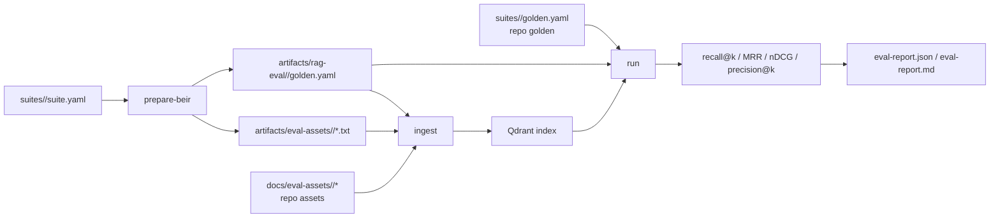

# RAG 検索品質 評価ハーネス

このハーネスは、公開 retrieval benchmark の `corpus / queries / qrels` と、
repo 管理の専用 golden set を RAG に通し、文書レベルの検索品質を決定的に評価する。
LLM judge は使わない。

## 構成



## 主要ファイル

| ファイル | 役割 |
| --- | --- |
| `rag/eval/suites/beir_scifact/suite.yaml` | BEIR SciFact の取得元、split、閾値、実行規模 |
| `rag/eval/suites/agentic_rag_demo/golden.yaml` | 業務難所を突く専用 golden |
| `docs/eval-assets/agentic_rag_demo/` | 専用 golden の PDF 資産 |
| `rag/eval/beir.py` | BEIR 形式から text assets と generated golden を作る |
| `rag/eval/dataset.py` | generated golden の schema |
| `rag/eval/corpus.py` | text assets を通常の ingest 経路へ流す |
| `rag/eval/runner.py` | 検索結果をケースごとの指標へ変換 |
| `rag/eval/metrics.py` | recall / precision / MRR / nDCG / fact coverage |
| `rag/eval/report.py` | Markdown / JSON report と gate 判定 |

## 標準ディレクトリ

```text
rag/eval/suites/<suite>/suite.yaml
rag/eval/suites/<suite>/golden.yaml
rag/eval/suites/<suite>/baselines/<embedder>__<reranker>.json
docs/eval-assets/<suite>/
artifacts/eval-assets/<suite>/
artifacts/eval-cache/
artifacts/rag-eval/<suite>/
```

公開データセット本体と生成レポートは `artifacts/` 配下に置く。`artifacts/` は
`.gitignore` 対象で、repo にはコミットしない。専用 golden の小さな評価資産は
`docs/eval-assets/<suite>/` に置き、必要なものだけ repo 管理する。

## CLI

```bash
python -m eval prepare-beir --suite beir_scifact
python -m eval ingest --suite beir_scifact \
  --golden /data/eval-reports/beir_scifact/golden.yaml \
  --files-dir /data/eval-assets/beir_scifact
python -m eval run --suite beir_scifact \
  --golden /data/eval-reports/beir_scifact/golden.yaml \
  --gate --out /data/eval-reports/beir_scifact/eval-report.json
```

専用 golden:

```bash
python -m eval ingest --suite agentic_rag_demo
python -m eval run --suite agentic_rag_demo \
  --gate --out /data/eval-reports/agentic_rag_demo/eval-report.json
```

`prepare-beir` は `suite.yaml` を読み、BEIR の公式 zip を取得して generated golden を作る。
`query-limit` と `corpus-limit` で実行規模を調整できる。

## CI

`.github/workflows/rag-eval-smoke.yml` はモデル不要の単体テスト。
`.github/workflows/rag-eval-full.yml` はセルフホスト runner で実スタック評価を行う。

full eval は GitHub Step Summary に Markdown report を表示し、同じ内容を artifact として保存する。

## 限界

このハーネスは検索品質の評価であり、最終回答の faithfulness は評価しない。
回答生成品質は `runAgent` を対象にした別ハーネスで、LLM judge または RAGAS/G-Eval 系の
評価を追加する。
