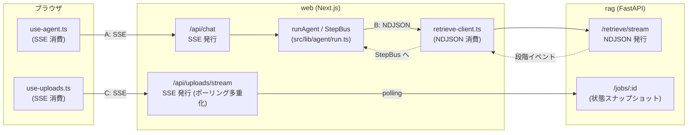
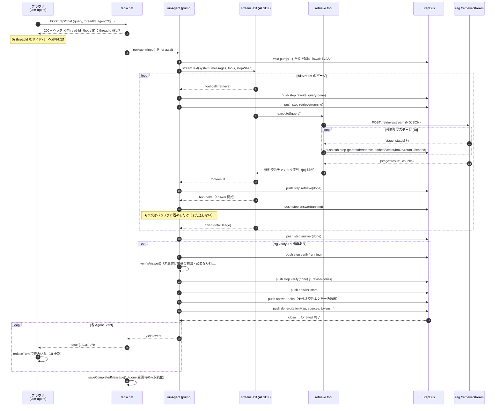
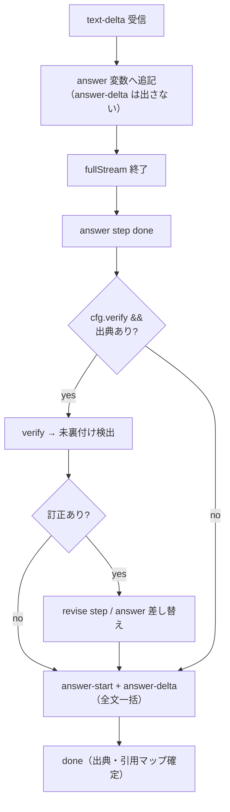
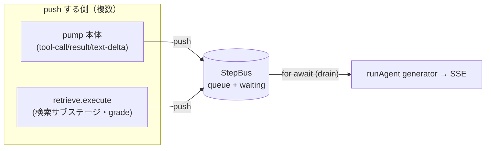
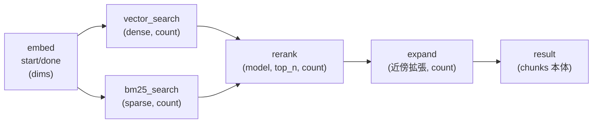
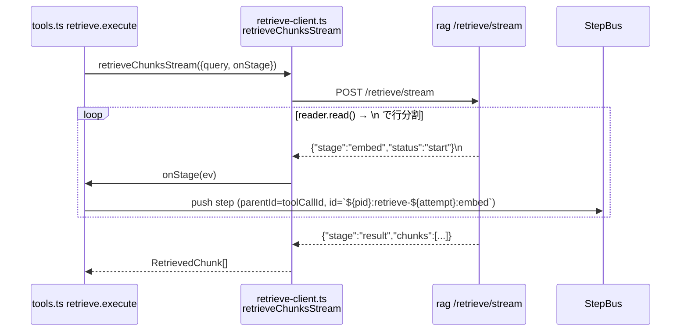
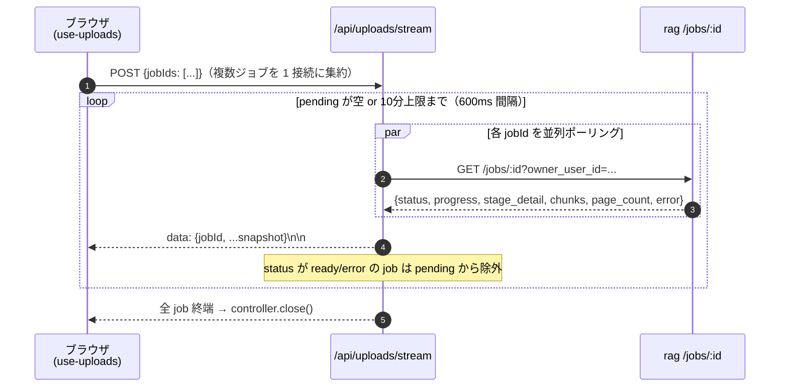

# SSE / ストリーミングの全体構造

このプロジェクトには **3 系統のストリーミング**がある。すべて「サーバが進捗を逐次 push し、
クライアントが畳み込む」という同じ思想だが、レイヤー・転送形式・用途が異なる。

| # | 流れ | 区間 | 転送形式 | 役割 |
|---|------|------|----------|------|
| **A** | **チャット Agent SSE** | ブラウザ ↔ `/api/chat` (web) | `text/event-stream`（SSE）<br>`data: {JSON}\n\n` | エージェント実行（ステップ・回答・出典）を逐次配信 |
| **B** | **retrieve サブステージ NDJSON** | web (TS) ↔ rag `/retrieve/stream` | `application/x-ndjson`<br>`{JSON}\n` | 検索の内部段階（embed→検索→rerank→expand）を逐次配信。**A の中に入れ子**になる |
| **C** | **アップロード進捗 SSE** | ブラウザ ↔ `/api/uploads/stream` (web) | `text/event-stream`（SSE） | 索引化ジョブの段階進捗を多重化配信（rag `/jobs` をポーリング） |

ポイントは **A と B の入れ子構造**。ブラウザから見える 1 本の SSE（A）の中に、
Python rag が出す検索の内部段階（B）が**サブステップとして合流**して流れてくる。
これを仲介するのが TS 側の `StepBus`。



---

## A. チャット Agent SSE（主役）

### A-1. 登場人物

| ファイル | 役割 |
|----------|------|
| `src/hooks/use-agent.ts` | **クライアント**。`fetch('/api/chat')` の body を `\n\n` で分割し `AgentEvent` を `reduceTurn` で畳み込む |
| `src/app/api/chat/route.ts` | **SSE 発行**。`runAgent()` の各 yield を `data: {JSON}\n\n` で enqueue。終了時に DB 永続化 |
| `src/lib/agent/run.ts` | **オーケストレータ**。`streamText` のループと検索サブステージを `StepBus` で統合し `AgentEvent` を yield |
| `src/lib/agent/step-bus.ts` | ツール `execute` と generator をつなぐ単一消費者 async キュー |
| `src/lib/agent/tools.ts` | `retrieve` / `fetch_document` ツール。検索サブステージを `bus.push` |
| `src/lib/types.ts` | `AgentEvent` のプロトコル定義 |

### A-2. プロトコル（`AgentEvent`）

サーバ → クライアントで流れる JSON は次の 5 種（`src/lib/types.ts`）。

```ts
type AgentEvent =
  | { type: "step";  step: ToolCall }                    // ステップの新規/更新（同 id で上書き）
  | { type: "answer-start" }                             // 回答本文の開始
  | { type: "answer-delta"; text: string }              // 回答本文（※後述：一括で 1 回だけ）
  | { type: "done"; tokens; durationMs; citationMap;     // 完了。出典・引用マップを確定
      sourceIds; sources; threadId }
  | { type: "error"; message: string };                 // 異常終了
```

`step` イベントの `ToolCall` は **id で同一視**され、`running → done/error` と
**同じ id を上書き**して状態遷移する（クライアントの `reduceTurn` がマージ）。
`parentId` を持つと**入れ子ステップ**（= retrieve の中の embed/rerank 等）になる。

### A-3. シーケンス（フルスタック 1 ターン）



### A-4. ★重要な設計：本文はストリームされず「一括送出」

トークン単位で本文が流れてくる**ように見えて、実は流れていない**。
`run.ts` の `text-delta` ハンドラは本文を `answer` 変数に**溜めるだけ**で、
`answer-delta` を出さない（`run.ts:144-152` のコメント「バッファ化」）。

理由は **生成後の根拠検証（verify / revise）**を本文確定前に挟むため。
検証で訂正が入った場合に、一度出した本文を撤回せずに済むよう、
**検証が終わってから `answer-start` → `answer-delta`（全文 1 回）** を送る（`run.ts:207-209`）。



> つまり UI 上は「ステップは逐次・本文は検証後に一気に出る」挙動になる。
> ストリーミングの体験を担っているのは**ステップ進捗（step イベント）**であって本文 delta ではない。

### A-5. StepBus（合流点）

`streamText` のループ（pump 本体）と、ツール `execute` の中（別タスク）から
**両方が `bus.push()` する**。これを 1 本の `AsyncGenerator` に直列化するのが `StepBus`。



- 単一消費者キュー。`push` 時に待機中の consumer があれば直接解決、なければ queue に積む。
- `pump` は `void pump(...)`（fire-and-forget）で起動し、**何が throw しても `finally` で必ず `bus.close()`**
  する（欠くと drain が永久ハング、`run.ts:42-43`）。

---

## B. retrieve サブステージ NDJSON（A に入れ子）

ブラウザには出てこない**内部 HTTP**。web (TS) が rag (Python) を呼び、
検索の段階を逐次受け取って `StepBus` に流し込む。**SSE ではなく NDJSON**
（`application/x-ndjson`、`{JSON}\n` 区切り）である点に注意。

### B-1. rag 側が出す段階（`rag/app/retrieval/service.py: retrieve_stream`）



各イベントは `{"stage": "...", "status": "start"|"done"|"error", "ms", "count", ...}`。
最後の `{"stage": "result", "chunks": [...]}` が検索結果本体（これだけ `onStage` を通さず戻り値になる）。

### B-2. TS 側の取り回し



- `stageToEvent`（`tools.ts:83`）が rag の段階を **`parentId` 付きサブステップ**に変換。
  id は `${parentId}:retrieve-${attempt}:${stage}`。`start` と `done` は**同 id**で
  reducer が `running→done` にマージする。
- **CRAG（再検索）**: `gradeModel` 指定時は取得後に `gradeChunks` で関連度判定。
  不足なら `rewrite_query` を出し直し、`attempt` を増やして再検索（同 stage が複数回流れるので
  id に `attempt` を含めて衝突回避）。`grade` ステップも `parentId` 付きで push。
- なお非ストリームの `/retrieve`（`retrieveChunks`）も存在するが、現行エージェントは
  サブステージ可視化のため `/retrieve/stream` を使う。

---

## C. アップロード進捗 SSE（独立系統）

索引化（parsing→chunking→embedding→indexing→ready）の進捗をブラウザへ。
rag は**無改修**のままで、web 側がジョブ状態をポーリングして SSE に**多重化**する。



設計上の要点（`src/app/api/uploads/stream/route.ts`）:

- **多重化**: 旧「1 ファイル = 1 接続」をやめ、複数 jobId を 1 本の SSE に集約。
  ブラウザの「1 オリジン同時 6 接続」上限の枯渇を防ぐ。
- 各フレームは必ず `jobId` を先頭に含む（クライアントが対象ファイルを識別）。
- `req.signal` の `abort`（モーダルを閉じる/離脱）で即 `close`。10 分の安全上限あり。
- `X-Accel-Buffering: no` でリバースプロキシのバッファリングを無効化。
- 段階キーは `IngestStage = parsing | chunking | embedding | indexing | ready`（`src/lib/types.ts`）。

---

## 転送形式の比較（ハマりどころ）

| | A: チャット | B: retrieve | C: アップロード |
|---|---|---|---|
| Content-Type | `text/event-stream` | `application/x-ndjson` | `text/event-stream` |
| フレーム区切り | `\n\n`（空行） | `\n`（改行） | `\n\n` |
| 行プレフィックス | `data: ` あり | なし（生 JSON） | `data: ` あり |
| 1 メッセージ | `AgentEvent` | 段階イベント / result | ジョブスナップショット |
| クライアント | `use-agent.ts` | `retrieve-client.ts` | `use-uploads.ts` |
| 解析 | `split("\n\n")` → `slice(5)` | `split("\n")` → `JSON.parse` | `split("\n\n")` → `slice(5)` |

> **注意**: A/C は SSE 慣習（`data: ` + 空行）だが `EventSource` API ではなく
> `fetch` + `ReadableStream.getReader()` で読む（POST body を送る必要があるため）。
> B は SSE ですらなく NDJSON。同じ「逐次配信」でも 3 つで作法が違う。

---

## 永続化と耐障害

- **threadId の先出し**: `/api/chat` は body より先に `X-Thread-Id` ヘッダを返す。
  新規スレッドでも実行中にサイドバー履歴へ即登録でき、会話を見失わない（`route.ts:114-116`）。
- **永続化は done 受領時のみ**: `route.ts` のループが `done` を受けたら
  `saveCompletedMessage`（messages + citations）。失敗しても done 送出後なので
  クライアントへ error は返さずログのみ（`route.ts:91-99`）。
- **キャンセル**: クライアントの `AbortController.abort()` で fetch を中断。
  running 中のステップは `pending`＋「キャンセル」サマリへ書き換え（`use-agent.ts:198-209`）。
- **APIキー未設定 / 生成失敗**: `run.ts` が answer-start/delta/done の最小列を出して
  フォールバック文言で正常終了させる（drain がハングしないよう必ず done を出す）。

---

### 参照ファイル早見表

```
ブラウザ ── A ──> src/hooks/use-agent.ts
                 src/app/api/chat/route.ts        … SSE 発行・永続化
                 src/lib/agent/run.ts             … pump / バッファ本文 / verify
                 src/lib/agent/step-bus.ts        … 合流キュー
                 src/lib/agent/tools.ts           … retrieve/fetch_document・CRAG
                 src/lib/types.ts                 … AgentEvent 定義
        ── B ──> src/lib/agent/retrieve-client.ts … NDJSON 消費
                 rag/app/routers/retrieve.py      … /retrieve/stream 発行
                 rag/app/retrieval/service.py     … retrieve_stream 段階生成
        ── C ──> src/hooks/use-uploads.ts
                 src/app/api/uploads/stream/route.ts … ポーリング多重化 SSE
```
